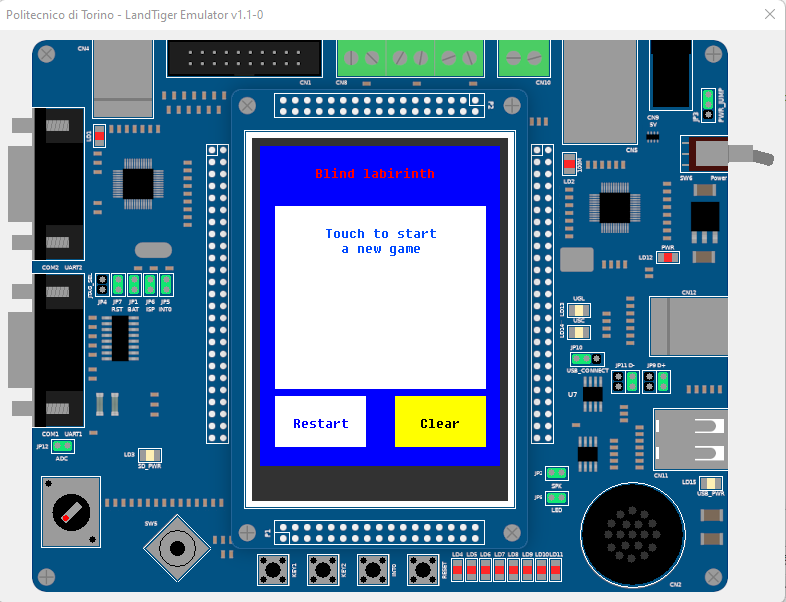
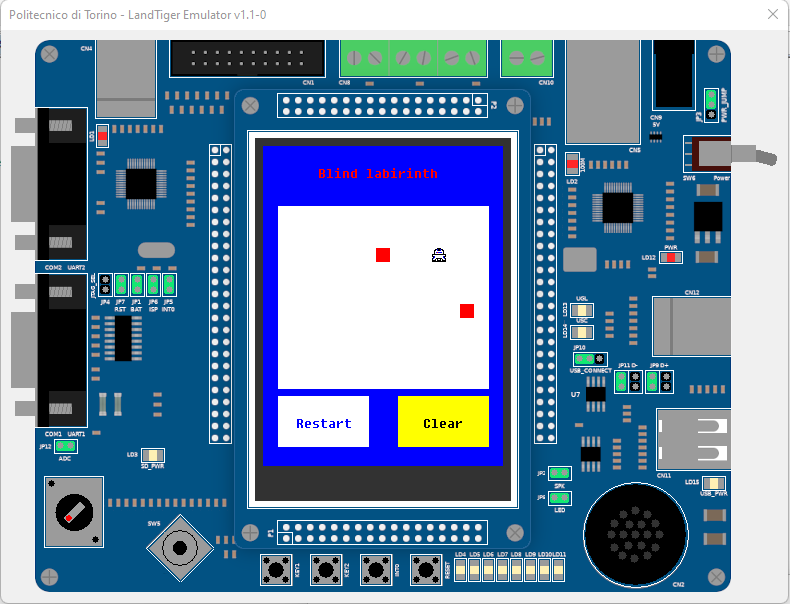

# Blind Labyrinth

*Computer architectures* course project (academic year A.A 2020/2021) at Polytechnic University of Turin

## Description

Creation of a mini video game from scratch `"Blind Labyrinth"`(similar to Minesweeper) by interacting with the various components of the development board used (joystick, LCD interface, LEDs...)

## Details

- Development board: [LandTiger LPC17XX Development Board](https://os.mbed.com/media/uploads/wim/landtiger_v2.0_-_manual__v1.1.pdf)
- Languages: `C, ARM Assembler`

## Screenshots (an emulator of the board was used)

## How to run (only for Windows)

You will need [Keil v5](https://www2.keil.com/mdk5). After installing it, you can execute `sample.uvprojx`